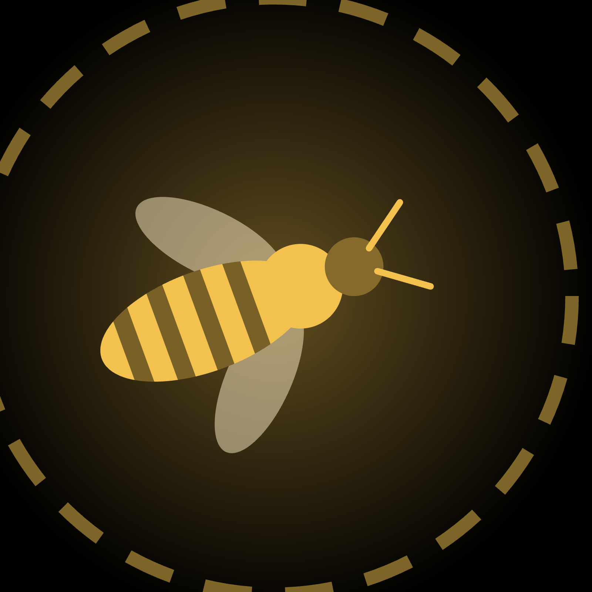
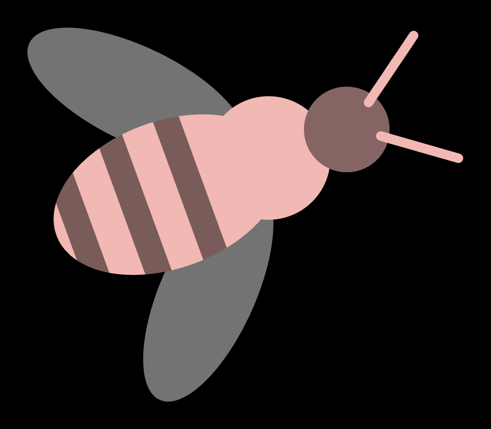
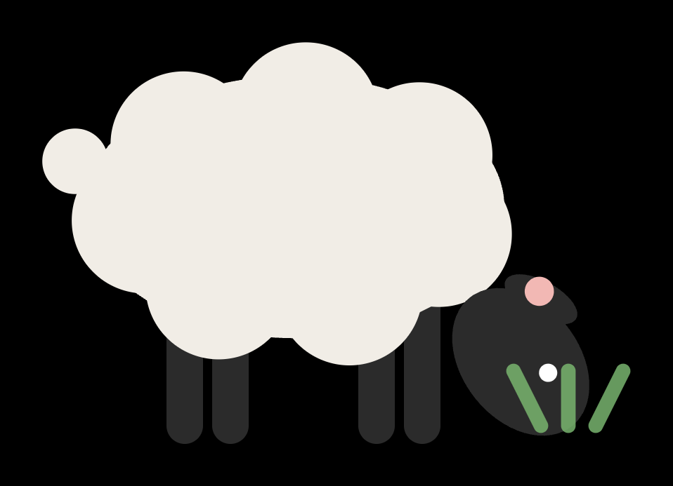
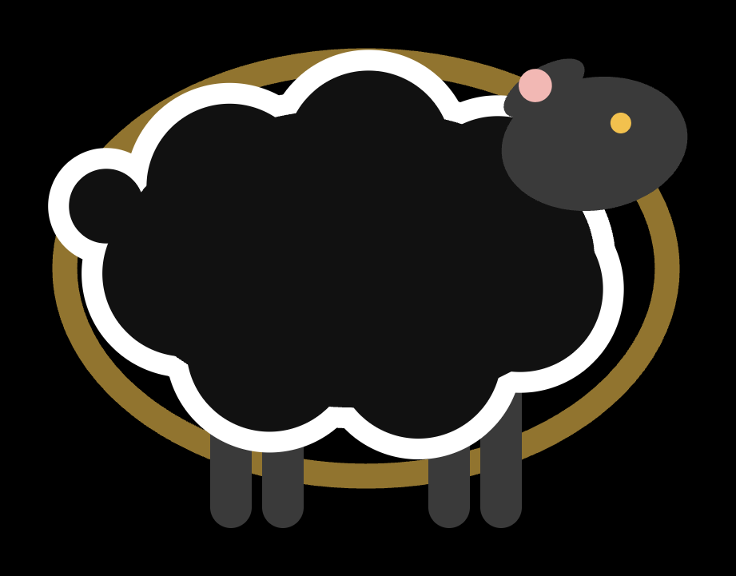

# HIVE — swarm audio

<p align="center"></p>

*Team HIVE · Music & AI Hackathon 2026, Uttendorf (Austria–Japan)*

HIVE turns a room full of people into a swarm you can hear. Anyone scans a QR
code and their phone joins as an animal on the wall — a bee or a sheep —
steered by nothing but the tilt of the device in their hand. A Mac collects
the motion of every phone at 60 Hz, conditions it and computes what the swarm
is doing as a whole: how alike people move, whether they are in step, the
collective tempo, who leads and who follows. One of them is the queen, crowned
by moving most and lost by being caught — sometimes in the open, sometimes
hidden so the room has to find her by ear. A camera adds the crowd that has no
phone: dense optical flow over the whole picture gives the audience's motion,
density and beat; a pose model reads gestures in the front rows. Everything is
broadcast as OSC to whatever instruments the team plugs in, and *morpho* — four
neural audio models played by that stream — turns it into sound. The sound is
not a recording of the crowd but the crowd itself, playing, with a few named
voices moving through it.

```
phones ──tilt, 60 Hz──▶ ┌────────────────────────────┐ ──OSC/UDP──▶ morpho (4 Neutone models, one voice per phone)
webcam ──YOLO + flow──▶ │  backend on the Mac (Node)  │ ──OSC/UDP──▶ Pd / Max / SuperCollider / REAPER / Python
                        │  /hive/sample · swarm ·     │
                        │  global · cam · mix · queen │ ──▶ /wall      projector: the swarm as bees or sheep, the crowd as weather
                        └────────────────────────────┘ ──▶ /monitor   laptop: every setting, every number, what the camera sees
```

## The two halves

| folder | what | docs |
|---|---|---|
| [`backend/`](backend/) | Node/TypeScript server; phone web app (EN · DE · 日本語); projector wall; dashboard; Python camera pipeline; all signal processing; OSC out | [backend/README.md](backend/README.md) — run, dashboard, every feature with its maths · [backend/docs/OSC.md](backend/docs/OSC.md) — the protocol, generated |
| [`morpho/`](morpho/) | Four Neutone neural audio models in parallel, each fed a synth voice per phone or the room mic, every knob routable from the swarm's OSC; the queen as a musical role | [morpho/README.md](morpho/README.md) — install, the window control by control, routing, what it costs |

## Try it in five minutes

```bash
git clone git@github.com:emilpasqualini/SwarmAudio.git && cd SwarmAudio/backend
./start.sh                      # server + dashboard at http://localhost:8080/monitor + the camera process
./start.sh --sim 5              # …with five fake phones, no hardware needed
```

Phones on the same Wi-Fi scan the QR code, tap through the self-signed
certificate once, tap **join** — and are on the wall (`http://localhost:8080/wall`,
put it on the projector). Press **start** on the dashboard. To hear something
without the sound side, the dashboard's *test tones* play one sine per phone;
for the real thing, on the machine that runs the audio:

```bash
cd ../morpho && pip install -r requirements.txt && python morpho_rack.py --input synth --default-routing
```

and add that machine's IP as an OSC target on the dashboard. `python3
backend/examples/osc_listen.py 9000` prints whatever a target would receive.
The camera pipeline needs its model once with internet (`./start.sh --vision`
fetches ~6 MB); after that everything runs offline on a hotspot.

## What the phones send, and what the server makes of it

Phones send raw sensors only — acceleration with gravity and rotation rate,
60 Hz, in a compact binary frame — and the server computes everything, so every
patch and model sees the same numbers. Per phone (`/hive/sample`):

- **rel** — acceleration smoothed with a One-Euro filter and taken relative to
  an *adaptive zero*, so a phone held still at any angle reads 0 and only
  change produces signal;
- **activity** — how much the phone turns or is jolted, 0..1;
- **turn** — rotation about the room's vertical, however the phone is held;
- **idle**, magnitudes, and **queen** — 1 while this phone holds the crown.

Whole swarm (`/hive/swarm`): energy, motion, sync. Meta-parameters
(`/hive/global`), signal-processing style: **coherence** (pairwise correlation
of movement — do people move alike?), **phaseSync** (Kuramoto order parameter —
are they in step?), **tempo** (the collective rhythm, Hz), **centroid**
(spectral: sway or jitter), **entropy** (everyone or a soloist), **dispersion**,
**lean**, **onsets**, **crest**.

## The camera

A Python process (YOLO11n-pose on Apple's Neural Engine or GPU, OpenCV) feeds
the server; the dashboard shows the annotated picture live. Two modes:

- **field** — for a room of a hundred: dense optical flow on an 8×6 grid gives
  where the crowd moves, how hard, how alike (**flowCoherence**), and its
  **beat**; a density grid and gestures (arms up, crouch) from the front rows a
  few times a second. Works in the dark, with everyone overlapping, no ids.
- **people** — for small rounds: full-rate tracking, groups (DBSCAN) with each
  group's share of everyone, and crowd motion from frame to frame (flow,
  turbulence, converge, nearest, stillness, occupancy).

Nobody in the picture is matched to a phone: the camera is a *field*, the
phones are the *agents*. `/hive/mix` says where the two meet — how far the
swarm hovers from the crowd, how many bees fly inside a group, whether the
queen is among people, whether swarm and crowd drift the same way. On the wall
the crowd is weather under the animals; with *coupling* on they are drawn to
where it moves, with *crowd shoves* it nudges them along.

## The wall and the queen

<p align="center">
&nbsp;&nbsp;
&nbsp;&nbsp;

</p>

Each phone is an animal (dashboard: *species* — bees beat their wings with
activity, sheep walk and, at rest, lie down or graze). The phone is a two-axis
joystick: tip it and the animal goes that way, the further the faster; level is
stop. Edges push back softly, animals keep a little distance, and the same
input always gives the same path.

One animal is the **queen** — bigger, golden (bees) or black (sheep), a halo.
The server decides: crowned by hand on the dashboard, or, while the throne is
vacant, the phone that moved most within *queen after* seconds; on the wall a
bee that flies into her takes the crown. With **hidden queen** on, nobody sees
who she is — not even her own phone — only the dashboard and OSC know, and the
room has to find her by ear. That is what *morpho* is for: seven queen modes
(loudest, duck, solo, tuning, harmony, drone, …) and a *queen split* that gives
her one timbre and the crowd another.

**Start / pause / reset** on the dashboard: people can join while paused (the
animals hover, phones say *waiting*), start lets it all go, reset clears the
queen and re-spawns everyone.

## The dashboard

Everything is configured at `http://localhost:8080/monitor`, live, and saved to
`backend/hive.config.json`: OSC targets (fan-out to any number of laptops, with
Ping), fake phones, rates and timeouts, the One-Euro filter and the adaptive
zero, queen and hidden queen, species, Wi-Fi name and password (rendered as a
*join this network* QR code on the wall), which QR codes the wall shows, the
camera (main switch, which camera, mode, cluster radius, mirror, coupling,
shoves), which OSC families go out — and one chip per small message, so what
nobody patches is not sent. The protocol tables it renders are generated from
the same source as `docs/OSC.md`, so the three cannot disagree.

## The protocol

OSC 1.0 over UDP, version 4. Wide messages (`/hive/sample`, `/hive/swarm`,
`/hive/global`, `/hive/cam`, `/hive/mix`) carry everything in a fixed order and
are only ever *appended* to; per-field twins (`/hive/dev/<slot>/rel`,
`/hive/cam/cluster/<i>/share`, `/hive/global/tempo`, …) suit `route`-style
patching; events (`/hive/join`, `/hive/leave`, `/hive/queen`, `/hive/roster`)
and a raw JSON WebSocket feed for code. Every message, every field:
[backend/docs/OSC.md](backend/docs/OSC.md). Ready-made receivers in
[backend/examples/](backend/examples/) — Pure Data, Python (stdlib only).

## Reading further

- [backend/README.md → Every feature, mathematically](backend/README.md#every-feature-mathematically)
  — the One-Euro filter, the adaptive zero, `turn`, every swarm and camera
  feature as a formula, the wall's flight model.
- [morpho/README.md](morpho/README.md) — the models (48 official Neutone
  models, anything from Cocoon or the SDK), the synth, the queen modes, the
  routing table, why inference never runs in the audio callback.
- [CLAUDE.md](CLAUDE.md) — the working agreements for the repo (also read by
  AI assistants): keep to your folder, append-only protocol, English in code.

## Design

Black `#000000`, accent `#F2B8B4`, white text; **Young Serif** for headings,
**Bitter** for text (both self-hosted, so it works offline); the queen in
`#F2C14E`; ten slot colours around the accent's hue at one lightness. Artwork
for slides and posters in [backend/docs/art/](backend/docs/art/).

## Licence

GPL-3.0 — see [LICENSE](LICENSE). Team HIVE, 2026.
